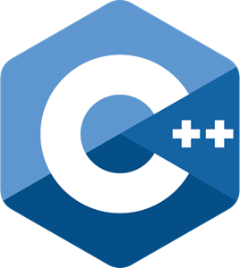

<!-- **Debargha-Mitra-Roy/Debargha-Mitra-Roy** is a ✨ _special_ ✨ repository because its `README.md` (this file) appears on my GitHub profile. -->

  

  

  
  
  
  
  
  

  
  

    

  

# Connect with me :

<!-- 

<a href="https://discord.com/users/975998538993516564">
  

<a href="https://t.me/debarghamitraroy">
  

 -->

<!--  -->
<!--  -->

<!--    -->

# Languages :

  

# Tools :

  

# Frameworks :

  

# About Me :

- 🔭 I’m currently pursuing B.Tech from Jalpaiguri Government Engineering College
- 🌱 I’m a all time learner
- 👯 I’m looking to collaborate on GitHub
- 🤔 I’m looking for help with Development
- 💬 Ask me about C++

# My GitHub Stats :

    

# Some of the projects I have worked on 👨‍💻 :

# My Competitive Programming stats : 

  

# Wanna listen a music?

  <!--  -->
  

