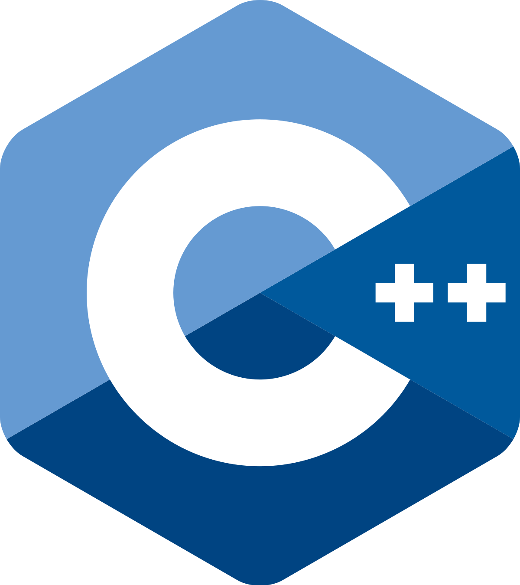

  

  

  
  
  
  
  
  

  
  

    

  

 

# Connect with me :

 

# Languages :

   

# Tools :

   

# Frameworks :

   

# About Me :

- 🔭 I’m currently pursuing final year B.Tech from Jalpaiguri Government Engineering College
- 🌱 I’m a all time learner
- 👯 I’m looking to collaborate on GitHub
- 🤔 I’m currently focusing on Machine Learning & Deep Learning
- 🥅 2024 Goals: _Eat, Sleep, Code, Repeat_
- 🧗 I try to: Go beyond and push the bounds
- ⚡ One day I will make it happen
- 💬 Ask me about anything

 

# My GitHub Stats :

  <a href="https://github-readme-stats-sigma-five.vercel.app/api?username=Debargha-Mitra-Roy&count_private=true&show_icons=true&theme=radical">
    
  

  

  
  

  
  

  

  

 